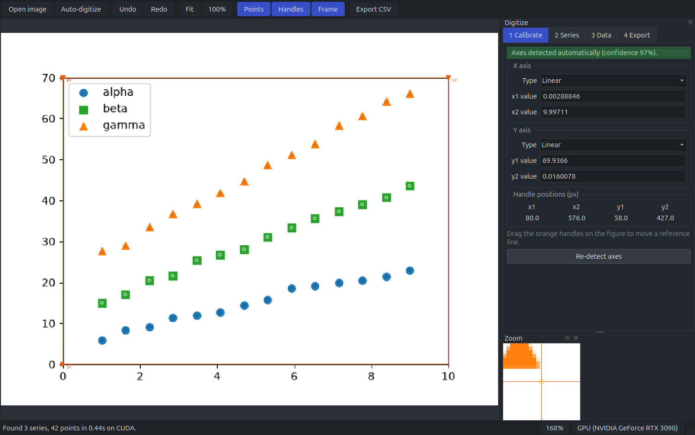

# Claude is King!

Read the numbers back out of a picture of a plot.

Point it at a figure and it finds the axes, reads the tick labels, works out whether the
scales are linear or logarithmic, separates the curves and extracts their points. You
check the result and export a CSV.



## Install

Download the AppImage from the [latest release](https://github.com/shashwotpaudel/plotdigitizer/releases),
make it executable and run it:

```bash
chmod +x plotdigitizer-v0-x86_64.AppImage
./plotdigitizer-v0-x86_64.AppImage
```

Or install from source:

```bash
git clone https://github.com/shashwotpaudel/plotdigitizer.git
cd plotdigitizer
python3 -m venv .venv && .venv/bin/pip install -e .
```

Python 3.11 or newer. Use `.[gpu,torch]` instead of `.` for GPU acceleration.

## Run

```bash
plotdigitizer-gui figure.png
```

Or without a window, over a directory of figures:

```bash
plotdigitizer figures/ -o out/
```

## Documentation

Full guide at **[shashwotpaudel.github.io/plotdigitizer](https://shashwotpaudel.github.io/plotdigitizer/)** —
[getting started](docs/getting-started.md), [the interface](docs/interface.md),
[workflows](docs/workflows.md), [command line](docs/cli.md), and an
[FAQ](docs/faq.md) covering what the tool cannot do.

## Accuracy

Measured against figures rendered from known data, so the comparison is with the real
numbers rather than an estimate. Axis calibration lands within 1.5 px on every test
figure; extracted points sit about 0.14 % of the axis range from the truth, roughly a
fifth of a pixel on a 500-pixel axis. The [FAQ](docs/faq.md#how-accurate-is-it) explains
how to reproduce that.

## License

MIT. See [LICENSE](LICENSE).
